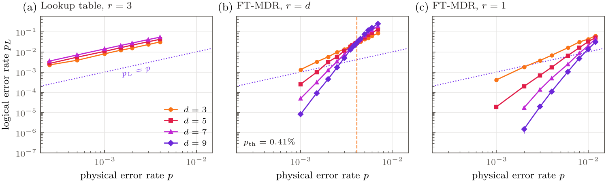
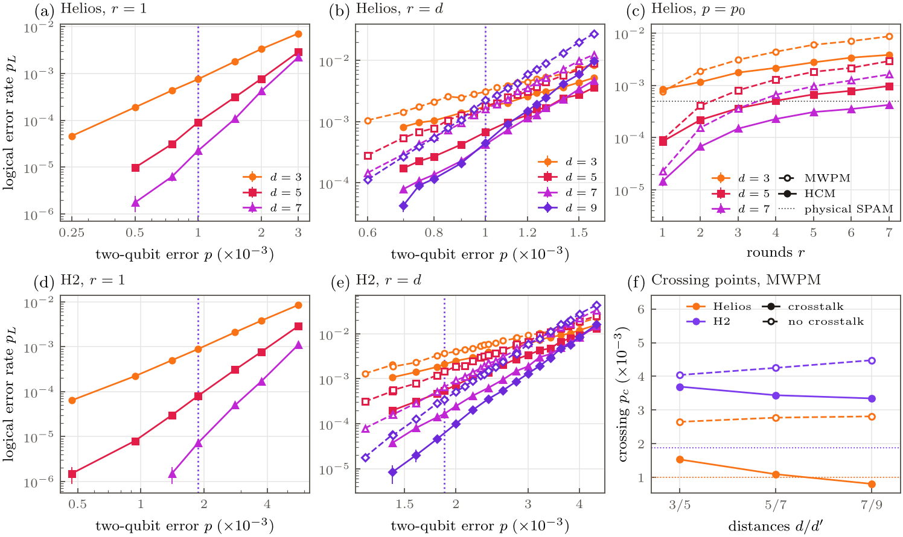
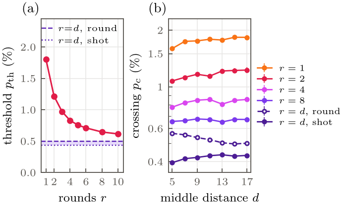

# Fault-tolerant MDR preparation of $|\bar{+}\rangle$ for the $XYZ^2$ code

Code: `src/mdr/ft/`. Tests: `tests/test_ft_mdr.py`,
`tests/test_two_level_decoder.py`. Scripts:
`scripts/run_ft_mdr_sweep.py`, `scripts/run_decoder_threshold_sweep.py`,
`scripts/report_ft_mdr_fault_distance.py`, `scripts/export_ft_mdr_qasm.py`.
Decoders and thresholds: `docs/ft_mdr_decoders.md`.

## Why the old protocol hits a noise floor

The old paths have circuit-level fault distance 1. Stim's
`search_for_undetectable_logical_errors` finds a single fault that flips the
logical outcome without firing any detector, for every distance and every
number of rounds. No decoder can fix that, which is why the lookup table, the
MPS-MLD decoder, and extra MDR rounds all give the same floor. Four things
cause it.

1. `full_mdr` measures $\bar{X}$ itself with one bare ancilla and applies the
   $\bar{X}$ toggle on that outcome. One ancilla fault on that check is a
   logical error. The simulated logical error is $p_L \approx 8p$ at $d=3$,
   $11p$ at $d=5$ and $14p$ at $d=7$, so larger codes are worse.
2. The lookup table applies toggles round by round. Each round overwrites the
   frame with the newest raw syndrome, so the history that separates
   measurement errors from data errors is thrown away. This is why round 1
   already sits at the steady state.
3. `link_logical_plus` starts from $|+\rangle^{\otimes n}$. On that state only
   the XX links and $\bar{X}$ are deterministic. A $Z$ error on the upper or the
   lower vertex of a block flips the same link, but only one of them flips
   $\bar{X}$, so the two cannot be told apart. The same happens at readout,
   because measuring every qubit in $X$ reconstructs only the links.
4. The reported fidelity is the raw $\langle\bar{X}\rangle$ of the final
   destructive readout, with no decoding of that readout.

The noise model of the first manuscript draft had a separate issue. Its
two-qubit channel gave every one of the 15 Paulis probability
$1.4\times10^{-3}$, so the total two-qubit error was $2.1\times10^{-2}$ for
the unbiased model, $9.8\times10^{-3}$ for Z-type and $4.2\times10^{-3}$ for
pure-Z. The fidelity gap between those models mostly measured the total
error, not the bias. `CircuitNoise.biased(p, eta)` keeps the total at $p$.

## The protocol

### 1. Frame initialisation

The $XYZ^2$ code is a YZZY surface code on $d\times d$ blocks concatenated
with the $[[2,1,1]]$ code of each XX link. A block-local Clifford map turns
the YZZY code into a CSS surface code in which class-B plaquettes ($i+j$
even) are Z-type, class-A plaquettes are X-type and $\bar{X}$ is a Z-type
logical. We prepare the image of $|0\rangle^{\otimes d^2}$ in that frame.
Block $(i,j)$ with $i+j$ even is prepared in $|+\rangle|+\rangle$. Block
$(i,j)$ with $i+j$ odd is prepared with $|0\rangle$ on the upper vertex and
$|{+i}\rangle$ on the lower vertex. In this product state $\bar{X}$ and a
subgroup $S_0$ of $d^2$ independent stabilizers are deterministic. $S_0$ is
generated by the even-block links, the class-B hexagons and the class-B
boundary checks, some multiplied by one odd-block link. The smallest undetectable flip pattern that
changes $\bar{X}$ has weight $d+1$. For $d=3$:

| qubits | state |
|---|---|
| 0, 1, 6, 7, 8, 9, 10, 11, 16, 17 | $\lvert+\rangle$ |
| 2, 3, 12, 13 | $\lvert0\rangle$ |
| 4, 5, 14, 15 | $\lvert{+i}\rangle$ |

### 2. Measurement

All $2d^2-1$ checks, including the links, are measured with one ancilla each
in a depth-6 interleaved schedule. Hexagons with $i+j$ odd touch their
positions in the order top, upper-left, upper-right, lower-left, lower-right,
bottom. Hexagons with $i+j$ even use top, upper-right, lower-right, bottom,
upper-left, lower-left. Link CNOTs sit in layers 1 and 2. We picked the schedule
from all 8928 valid translation-invariant depth-6 schedules with an
exhaustive fault-distance scan. At $d=3$ with three rounds, 3968 schedules
have fault distance 2, 3834 have 3 and 1126 have 4.

### 3. Decoding

We decode the whole space-time history at once. With `detectors="s0"` each
$S_0$ check gives one detector in round 1 against its deterministic initial
value, one per later round against the previous round, and one at the end
against the frame readout. Every fault flips at most two of these after
Stim's decomposition, so PyMatching decodes it directly. With
`detectors="combined"` the circuit also declares round-to-round detectors for
the $d^2-1$ gauge generators, which are the odd links, the class-A hexagons
and the class-A boundary checks. The decoders of `TwoLevelDecoder` use them.
Hierarchical correlated matching (`mode="corr_split", lower="gauge"`) is the
recommended decoder.

### 4. Recovery

The decoder returns one bit, whether $\bar{X}$ was flipped. The recovery is a
Pauli frame update. It consists of that logical bit and the toggles for the
random checks, read from their first measured values. Nothing has to be applied physically
before a non-Clifford gate.

### Readout for hardware verification

Measure even blocks in $X$, upper vertices of odd blocks in $Z$ and lower
vertices of odd blocks in $Y$. This reconstructs $\bar{X}$ and all of $S_0$,
with readout distance $d+1$.

## Results

We computed the circuit-level fault distance exactly with CP-SAT on the
detector error model (`scripts/exact_fault_distance.py`). For every frame
instance below except $d=7$ with seven rounds, no undetectable logical error
with $d$ or fewer faults exists, and one with $d+1$ faults does.

| $d$ | rounds | start | readout | mechanisms | fault distance |
|---|---|---|---|---|---|
| 3 | 1 | frame | frame | 51 | 4 |
| 3 | 1 | frame | ideal | 51 | 4 |
| 3 | 3 | frame | frame | 125 | 4 |
| 3 | 3 | frame | ideal | 125 | 4 |
| 5 | 1 | frame | frame | 153 | 6 |
| 5 | 1 | frame | ideal | 153 | 6 |
| 5 | 5 | frame | frame | 613 | 6 |
| 5 | 5 | frame | ideal | 613 | 6 |
| 7 | 1 | frame | frame | 311 | 8 |
| 7 | 7 | frame | frame | 1733 | 7 or 8 |
| 3 | 3 | $\lvert+\rangle^{\otimes n}$ | frame | 465 | 2 |
| 5 | 5 | $\lvert+\rangle^{\otimes n}$ | frame | 3309 | 2 |

For $d=7$ with seven rounds CP-SAT does not finish. The lower bound of seven comes from
`scripts/fault_distance_lp_bound.py` and the upper bound from the search of Stim.
The $\lvert+\rangle^{\otimes n}$ start uses all generator detectors.

Logical error rate under SD6 noise with $p = 10^{-3}$ and frame readout.
SD6 applies two-qubit depolarizing noise of strength $p$ after every gate and
single-qubit depolarizing noise to every idle qubit, and flips every
preparation and measurement with probability $p$. A flip is the Pauli that
anticommutes with the prepared or measured operator, so it is a $Z$ error
for the $X$ basis and an $X$ error for the $Y$ and $Z$ bases (`_FLIP` in
`ft_mdr_circuit.py`). The ancillas are reset with `RX` and measured with `MX`,
so both of their flips are `Z_ERROR`.

| decoder, rounds | $d=3$ | $d=5$ | $d=7$ | $d=9$ |
|---|---|---|---|---|
| old `full_mdr` + lookup (no idle noise) | $8.0\times10^{-3}$ | $1.1\times10^{-2}$ | $1.4\times10^{-2}$ | |
| FT MDR, $r=1$ | $4.1\times10^{-4}$ | $1.9\times10^{-5}$ | $\approx10^{-6}$ | |
| FT MDR, $r=d$, MWPM | $1.3\times10^{-3}$ | $2.5\times10^{-4}$ | $4.9\times10^{-5}$ | $8\times10^{-6}$ |
| FT MDR, $r=d$, HCM | $1.0\times10^{-3}$ | $1.3\times10^{-4}$ | $1.8\times10^{-5}$ | |

Thresholds ($r=d$) for every noise model and decoder are in
`docs/ft_mdr_decoders.md`.



## Quantinuum noise models (`CircuitNoise.trapped_ion`, `CircuitNoise.quantinuum`)

The models are built from the typical rates of the data sheets (Helios v1.2,
June 2026; H2 v2.00, October 2024) and checked against the dedicated
measurements on Helios (Ransford et al., Nature 2026, arXiv:2511.05465) and
against Quantinuum's own emulator noise model (Helios-1E, H2-1E). Average
infidelities $\epsilon$ are converted with $\epsilon = p\,2^n/(2^n+1)$ for
an $n$-qubit depolarizing channel and $\epsilon = 2p/3$ for a single Pauli
flip.

Like SI1000, each machine is a one-parameter family. The parameter is the
two-qubit depolarizing probability $p$, and every other rate keeps its
data-sheet ratio to $p$ (`CircuitNoise.trapped_ion(p, machine)`):

| channel | where | Helios | H2 |
|---|---|---|---|
| `DEPOLARIZE2(p)` | after every controlled Pauli (one native ZZ gate) | $p$ | $p$ |
| `DEPOLARIZE1(p1)` | both qubits of every gate (the 1Q rotations around the ZZ gate) | $0.045\,p$ | $0.024\,p$ |
| `Z_ERROR(p_mem)` | every qubit in every gate layer, data qubits in every measurement step | $0.9\,p$ | $0.4\,p$ |
| `DEPOLARIZE1(p_xt^(k))` | data qubits, once per step that measures and resets $k$ ancillas | $p_{\rm xt}=0.075\,p$ | $p_{\rm xt}=0.008\,p$ |
| `Z_ERROR` / `X_ERROR` flips | before every measurement and after every reset, in the basis of the operation | $0.25\,p$ each | $0.4\,p$ each |

The devices sit at $p_0 = 1.0\times10^{-3}$ (Helios, $\tfrac54\epsilon_2$ with
$\epsilon_2=8\times10^{-4}$) and $p_0=1.875\times10^{-3}$ (H2,
$\epsilon_2=1.5\times10^{-3}$). `CircuitNoise.quantinuum(machine, scale)` is the
same model with $p = $ `scale` $\times\,p_0$, and `crosstalk=False` removes the
crosstalk. The crosstalk is the data-sheet "global" average per spectator qubit
and per measured ancilla, so $k$ measured ancillas compose to
$p_{\rm xt}^{(k)} = \tfrac34[1-(1-\tfrac43 p_{\rm xt})^k]$. The Helios
emulator applies its crosstalk the same way, to every other qubit in the trap
at each mid-circuit measurement ($5.5\times10^{-5}$) and reset
($3.5\times10^{-6}$). `two_qubit="cb"` replaces the depolarizing gate noise by
the Pauli rates of the Helios RZZ gate from cycle benchmarking.

Logical error rate at the device point $p=p_0$ (HCM, MWPM in parentheses):

| model | $r=1$, $d=3$ | $r=1$, $d=5$ | $r=1$, $d=7$ | $r=d$, $d=3$ | $r=d$, $d=5$ | $r=d$, $d=7$ |
|---|---|---|---|---|---|---|
| Helios | 8.5e-4 (7.5e-4) | 8.4e-5 (9.0e-5) | 1.4e-5 (2.2e-5) | 1.8e-3 (3.1e-3) | 6.7e-4 (1.8e-3) | 4.2e-4 (1.6e-3) |
| Helios, CB gates | 6.5e-4 (6.3e-4) | 6.3e-5 (7.4e-5) | 1.3e-5 (1.6e-5) | 1.3e-3 (2.7e-3) | 4.6e-4 (1.4e-3) | 3.0e-4 (1.2e-3) |
| H2 | 8.9e-4 (8.9e-4) | 8.7e-5 (8.1e-5) | 8.0e-6 (7.2e-6) | 2.1e-3 (3.7e-3) | 5.5e-4 (1.5e-3) | 1.7e-4 (6.6e-4) |

Crossing points of consecutive distances for $r=d$ (MWPM, in units of
$10^{-3}$, from `paper/analysis/helios_plots.py`; data in
`docs/data/helios/ion_p_sweeps.csv`, sweep script
`scripts/helios/run_ion_p_sweeps.sh`):

| model | $d=3/5$ | $d=5/7$ | $d=7/9$ | device $p_0$ |
|---|---|---|---|---|
| Helios | 1.54(8) | 1.10(2) | 0.81(2) | 1.0 |
| Helios, no crosstalk | 2.65(7) | 2.78(8) | 2.81(4) | 1.0 |
| H2 | 3.69(7) | 3.44(8) | 3.35(6) | 1.875 |
| H2, no crosstalk | 4.04(5) | 4.25(10) | 4.48(8) | 1.875 |

With HCM the Helios crossings of $d=5/7$ and $7/9$ are $1.38(2)$ and $0.95(5)$.
The crosstalk per data qubit and round grows with the number of ancillas
($\propto d^2$), so the crossings fall with $d$ and the Helios model has no
threshold; without the crosstalk it has one at about $2.8\times10^{-3}$.
Helios holds $d \le 5$ (95 qubits with `share_ancillas=4`), H2 holds $d=3$.
Error budget (HCM, $p=p_0$, `scripts/helios/helios_error_budget.py`):
removing the memory error lowers $p_L$ 6 to 10 times at $d=3,5$; at $d=7$,
$r=7$ removing the crosstalk lowers it 15 times.



Other findings:

- More rounds before decoding add error linearly in $r$. There is no floor,
  and $r=1$ is the best choice for preparation. Under the Helios model at
  $p=p_0$ each extra round adds $4.8\times10^{-4}$, $1.4\times10^{-4}$ and
  $6.9\times10^{-5}$ ($d=3,5,7$) with HCM and $1.2\times10^{-3}$,
  $4.0\times10^{-4}$ and $2.1\times10^{-4}$ with MWPM.
- With the total error held fixed, the threshold of plain matching barely
  moves with the bias. The bias only pays off with a decoder that reads the
  gauge detectors (HCM, belief-matching).

## Pair measurements (EM3)

`CircuitNoise.em3(p)` is the entangling-measurement model of Gidney et al.
(Quantum 5, 605): every two-qubit Pauli product measurement is followed, with
probability $p$, by a uniformly chosen element of
$\{I,X,Y,Z\}^{\otimes 2}\times\{\text{flip},\text{no flip}\}$, idle qubits get
`DEPOLARIZE1(p)` in every step, preparations and measurements are flipped with
probability $p$. With this model `FTMDRCircuit` builds a gate-free circuit
(`FTMDRCircuit._build_pairs`):

- links $X_uX_l$ are measured directly by one MPP;
- a plaquette of weight $w$ uses $w$ ancillas, reset in $|+\rangle$ and joined
  into a cat state by $w-1$ MPPs $Z_aZ_{a'}$ along a tree (`cat_tree`): every
  block hangs from the centre, so a wrong tree outcome acts like an error on one
  qubit or on the two qubits of one block;
- each ancilla is measured jointly with its data qubit, $X_aP_q$, and read out
  in $Z$ in the next step; the plaquette is the product of the $w$ coupling
  outcomes;
- a coupling flips the sign of every overlapping check by the $Z$ readouts and
  the cat parity on the qubits where the two checks differ; the detectors and
  the observable include these signs;
- plaquettes are three-coloured (`plaquette_colors`) and coupled colour by
  colour, two ancilla banks alternate, and a round has four steps.

The fault distance is $d$, one less than with gates, because a link MPP or a
block-aligned tree fault can put a two-qubit error on a block and $\bar Y$
contains two qubits of one block (CP-SAT: `python
scripts/exact_fault_distance.py --noise em3 --distance 5 --rounds 5
--max-faults 4` is infeasible). Thresholds ($r=d$, $d=5,7,9$): MWPM 0.22%,
HCM 0.28% (`scripts/run_em3_sweeps.sh`).

## Threshold versus the number of rounds

SD6 noise, MWPM on the $S_0$ detectors, every odd distance from 3 to 19 (the
code needs odd $d$), $p$ from $2\times10^{-3}$ to $0.1$ plus a refinement around
the crossings, 21.4 million shots in total
(`scripts/run_rounds_threshold_sweep.py`, data in
`docs/data/rounds_threshold/`). Every curve rises to $p_L=1/2$ above the
crossing and the curves do not cross again up to $p=0.1$. Thresholds from the
finite-size scaling fit to $d=11$ to 19 (`paper/analysis/rounds_thresholds.py`):

| rounds $r$ | 1 | 2 | 3 | 4 | 5 | 6 | 8 | 10 | $d$ (per shot) | $d$ (per round) |
|---|---|---|---|---|---|---|---|---|---|---|
| $p_{\rm th}$ (%) | 1.80(3) | 1.22(4) | 0.97(1) | 0.83(1) | 0.75(1) | 0.71(1) | 0.64(1) | 0.61(1) | 0.435(3) | 0.501(8) |



For fixed $r$ the space-time volume is a slab of $r+1$ detector layers with
closed time boundaries, so a logical failure has to cross the patch inside the
slab. The threshold therefore falls with $r$. For $r=d$ the per-shot crossings
rise with $d$ and the per-round crossings, with
$\epsilon_L=[1-(1-2p_L)^{1/(r+1)}]/2$, fall with $d$, so the threshold of the
full space-time problem lies between 0.435% and 0.50%.

## Hardware plan

- $d=3$ on H2 or Helios: 18 data and 17 ancillas (35 qubits), 54 ZZ gates
  per round.
- $d=5$ on Helios: 50 data and 49 ancillas is 99 qubits. With
  `share_ancillas=4`, four link ancillas are measured and reset after layer 2
  and reused for four boundary checks that start later. That is 95 qubits,
  170 ZZ gates per round, the same fault distance (checked exactly) and the
  same $p_L$ within statistical error.
- `scripts/export_ft_mdr_qasm.py` writes OpenQASM 2.0 plus the annotated Stim
  circuit. Hardware shots are decoded with
  `S0MatchingDecoder(stim_circuit).decode_measurements(bits)` or with
  `TwoLevelDecoder` on a circuit built with `detectors="combined"`.
- Predicted $p_L$ (HCM, $p=p_0$) for $r=1,2,3$: $8.5\times10^{-4}$,
  $1.2\times10^{-3}$, $1.8\times10^{-3}$ at $d=3$ and $8.4\times10^{-5}$,
  $2.2\times10^{-4}$, $3.6\times10^{-4}$ at $d=5$. Resolving $8\times10^{-5}$
  to 20% takes about $3\times10^5$ shots; the $d=3$ points need ten times fewer.

Reproduce:

```bash
python scripts/report_ft_mdr_fault_distance.py --distances 3 5 7
python scripts/run_decoder_threshold_sweep.py --noise sd6 --decoders mwpm corr_gauge \
    --distances 3 5 7 9 --values 4e-3 4.5e-3 5e-3 5.5e-3 6e-3 --out data/ft_mdr/thresholds.csv
python scripts/run_decoder_threshold_sweep.py --noise helios_p --rounds 1 --decoders mwpm \
    --distances 3 5 7 --values 5e-4 1e-3 1.5e-3 2e-3 3e-3 --out data/ft_mdr/helios_r1.csv
sh scripts/helios/run_ion_p_sweeps.sh   # dense p sweeps of the Helios and H2 models
sh scripts/run_em3_sweeps.sh            # EM3 thresholds, data/ft_mdr/em3_sweeps.csv
```
